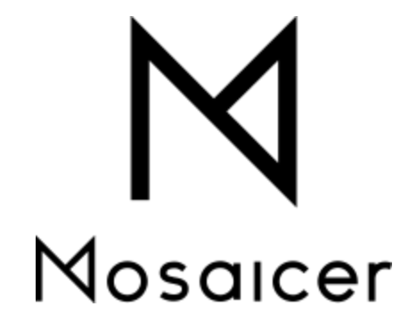
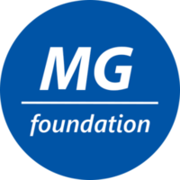
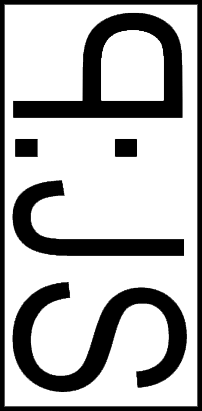
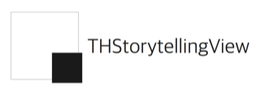

# 제 5회 결승전 수상작
(공동수상-알파벳 순)

## Mosaicer / 최우수상

* 특정 인물을 제외한 자동 모자이크 시스템 
* 라이선스 : MIT 
* 저장소 : https://github.com/seongahjo/Mosaicer

## flip / 우수상 

* 데이터의 확률 통계적 특징을 아주 빠르게, 적은 메모리만을 사용해, 간편하게 계산할 수 있는 순수 함수형 라이브러리 
* 라이선스 : MIT 
* 저장소 : https://github.com/xxxnell/flip

## mgcpp / 우수상 

* CUDA를 이용하여 C++ 멀티 GPU 프로그래밍을 쉽게 하기 위한 라이브러리 
* 라이선스 : BSL 1.0 
* 저장소 : https://github.com/MGfoundation/mgcpp

## LaunchPAD_JS / 장려상 

* 음악 믹싱 런치패드 
* 라이선스 : MIT 
* 저장소 : https://github.com/rouismia/LaunchPAD_JS

## naver_talk_sdk / 장려상 
* 네이버 톡톡 SDK 
* 저장소 : https://github.com/HwangWonYo/naver_talk_sdk

## THStorytellingView.git / 장려상 

* iOS 이미지 뷰어 
* 라이선스 : MIT 
* 저장소 : https://github.com/TileImageTeamiOS/THStorytellingView.git

## 제 5회 D2 CAMPUS FEST 결승진출팀

프로젝트|설명|라이선스
-|-|-
[AndroidLogData](https://github.com/AndroidLogData)|안드로이드 개발 로그 데이터 관리|MIT
[bigpicture-light](https://github.com/JuhoKang/bigpicture-light)|실시간 그림판 공유 및 채팅 프로그램|MIT
[daily-health-originer](https://github.com/ryuhangyeong/daily-health-originer)|다이어트를 위한 정보 기록 및 추천 영상을 통한 소셜 다이어트 코치|MIT
[Dr.Jekyll](https://github.com/MoonCrystalPower/Dr.Jekyll)|Jekyll을 사용한 블로그 관리 애플리케이션|MIT
[MyDiary](https://github.com/poirin/MyDiary)|포트폴리오 관리를 위한 웹 서비스|MIT
[Nanum](https://github.com/LandvibeDev/Nanum)|개발 협력 툴|MIT
[oh-my-desk](https://github.com/ahki/oh-my-desk)|웹 컨텐츠 관리를 위한 데스크탑 위젯|GPL v3
[IoT-Pet-Home-System  (구)opensourceproject](https://github.com/kuj0210/opensourceproject)|IoT 반려동물 급식기|GPL v3
[prefeel-lib](https://github.com/bbvch13531/prefeel-lib)|라이브러리 선택과 코딩 컨벤션 적용을 도와주는 웹 애플리케이션 |GPL v3

문의 : naver_d2@naver.com
